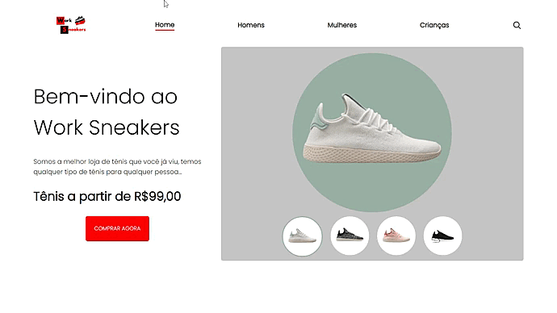

# Projetos-simples

Alguns projetos utilizando apenas HTML, CSS E JS

<tr>
    <td>
       
    </td>
   
   <td>
      
   </td>
   
   <td>
      
    </td>
</tr>
  
  <table border="1">
  <tr>
    <td>
        <h3 align="center">LandPage - WorkSnekers</h3>
        <li align="center"><a href="https://github.com/nomegustaa/Projetos-simples/tree/main/LandPage-WorkSnekers"> Código</a></li> 
        
    </td>
  </tr>
     
</table>
